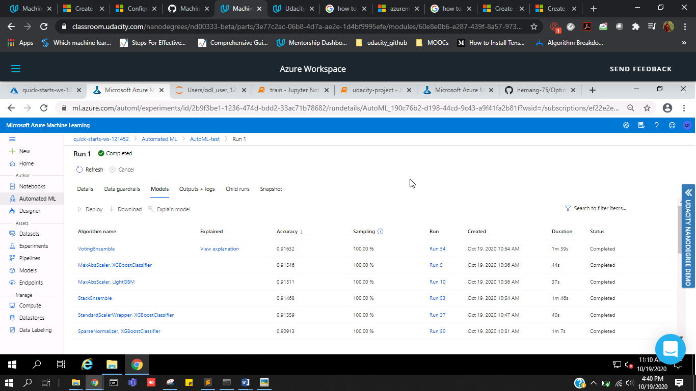
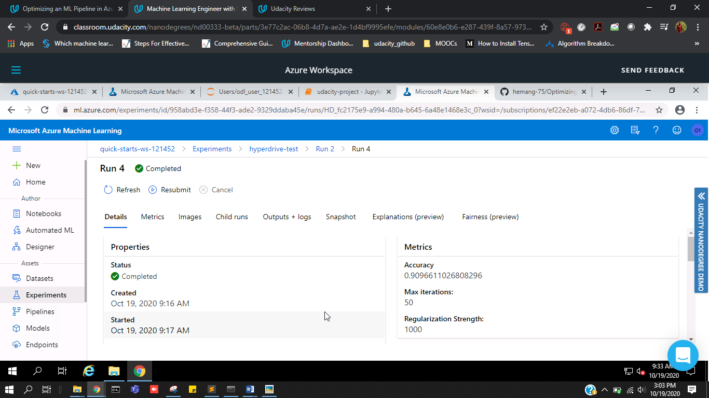
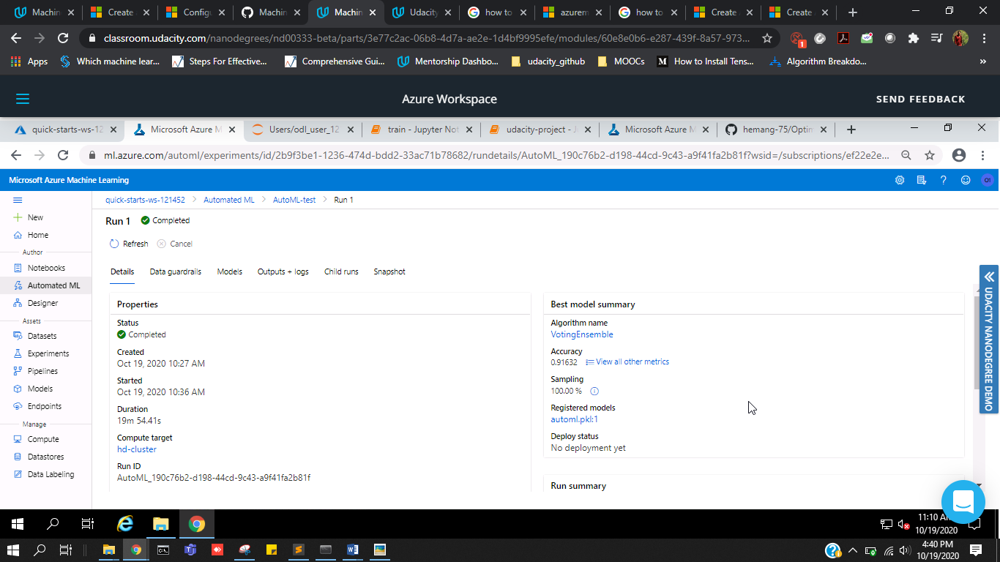
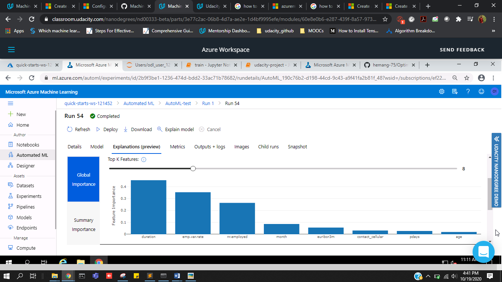
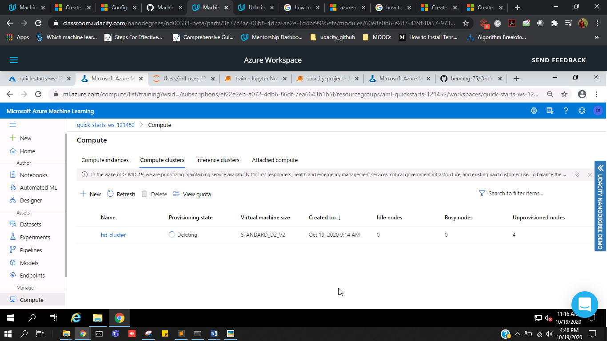

# Optimizing an ML Pipeline in Azure

## Overview
This project is part of the Udacity Azure ML Nanodegree its the first project in this nano degree program.

In this project, we manufacture and advance an Azure ML pipeline utilizing the Python SDK and a gave Scikit-learn model. 

The hyper-boundaries of the Scikit-learn model will be tuned utilizing Azure HyperDrive functionality.This model is then contrasted with an Azure AutoML run and then we compare performance of both of the methods using different metrics. 

## Summary

- In this problem the dataset contains data about the financial and personal details of the customers of a Portugese bank. We seek to predict if the customer will subscribe to bank term deposit or not. <br>
- First , a Scikit-learn based LogisticRegression model is trained using cleaned data set and then we tune hyperparameter of it using azure hyper drive  <br>
-At that point, the equivalent dataset is given to Azure AutoML to attempt to locate the best model utilizing its usefulness. <br>
- We came to know that Soft Voting Ensemble was the best performing model out of all the models found using AutoML.

## Scikit-learn Pipeline

### Pipeline Architecture
- In the Pipeline, first the dataset is recovered from the given url utilizing AzureDataFactory class in the train.py file. <br>
- Then we create a compute instance for our model to train on it.
- At that point the information is cleaned utilizing clean_data function in which some preprocessing steps were performed like changing straight out factor over to two fold encoding, one hot encoding, etc and afterward the dataset is part in proportion of 70:30 (train/test) for training and testing and sklearn's LogisticRegression Class is utilized to characterize Logistic Regression model. <br>
- The train.py content contains all the means expected to prepare and test the model which are information recovery, information cleaning and pre-handling, information parting into train and test information, characterizing the scikit-learn model and preparing the model on train information and foreseeing it on the test information to get the precision and afterward sparing the model. <br>
- A SKLearn estimator is created in which we pass it train.py script and the compute on which training of model should occur. 
- Then we create HyperDriveConfig by passing estimator, policy, hyperparameter sampling and primary metric name on which our model will be measured
- The hyperparameters which are should have been tuned are characterized in the boundary sampler. The hyperparameters that can be tuned here are C and max_iter. C is the converse regularization boundary and max_iter is the greatest number of emphasess. <br>
- Finally, the best model is saved using joblib <br>

### Benefits of parameter sampler
- The parameter sampler is utilized to give various decisions of hyperparameters to look over and have a go at during hyperparameter tuning utilizing hyperdrive. <br>
- I have utilized Random Parameter Sampling in the parameter sampler with the goal that it work very well and may be utilized to give irregular examining over a hyperparameter search space.
- For our problem, the hyperparameters gave in the hyperparamete search space are C and max_iter.The various decisions for the estimations of C and max_iter are given so that the hyperdrive can attempt all the blends of decisions to do the hyperparameter tuning to get the best model with the greatest exactness.

### Benefits of Early Stopping policy
- One can characterize an Early Stopping strategy in HyperDriveConfig and it is valuable in halting the HyperDrive run if the precision of the model isn't improving from the best exactness by a specific characterized sum after each given number of emphasess <br>
- In this model, we have characterized a Bandit Policy for early stopping with the boundaries slack_factor and evaluation_interval which are characterized as :
  - slack_factor :  The measure of slack permitted as for the best performing preparing run. This factor determines the leeway as a proportion. <br>
  - evaluation_interval : The recurrence for applying the policy. Each time the preparation content logs the essential measurement considers one span.<br>
- Early stop save a lot of compute resources by stopping the model on right time.

## AutoML
- AutoML means Automated ML which means it can automate all the process involved in a Machine Learning process. For example, we can automate feature engineering, hyperparameter selection, model training, and tuning and can train and deploy 100 models in a day all with the help of AutoML.
- When i applied AutoML to our problem, it did a great task and i was surprised to see that AutoML tried so many different models in such a short time some of which i couldn't even think of trying or implementing. The models tried by AutoML were RandomForests,BoostedTrees,XGBoost,LightGBM,SGDClassifier,VotingEnsemble, etc. AutoML used many different input preprocessing normalization like Standard Scaling, Min Max Scaling, Sparse Normalizer, MaxAbsScaler, etc. It has also handled class imbalance very well by itself. <br>
- To run AutoML, one needs to use AutoMLConfig class just like HyperdriveConfig class and need to define an automl_config object and setting various parameters in it which are needed to run the AutoML. Some of these parameters are : <br>
    - task : what task needs to be performed , regression or classification <br>
    - training_data : the data on which we need to train the autoML. <br>
    - label_column_name : the column name in the training data which is the output label. <br>
    - iterations : the number of iterations we want to run AutoML. <br>
    - primary_metric : the evaluation metric for the models <br>
    - n_cross_validations : n-fold cross validations needed to perform in each model <br>
    - experiment_timeout_minutes : the time in minutes after which autoML will stop. <br>
- Here is the list of all the models tested during AutoML run :



## Pipeline comparison

- Overall,the difference in accuracy between the AutoML model and the Hyperdrive tuned custom model is not too much. AutoML accuracy was 0.9163 while the Hyperdrive accuracy was 0.9096

- With Respect to architecture AutoML was better than hyperdrive because it tried a lot of different models, which was quite impossible to do with Hyperdrive because for that we have to create pipeline for every model.

- There was not much difference in accuracy maybe because of the data set but AutoML really tried and computed some very complex models to get the best result and model out of the given dataset.

The best run/model of HyperDrive : 



The best run/model in AutoML :



Some of the top features in our dataset as learnt by the best AutoML model are :



## Future work

- One thing which i would want in future as further improvement will be to able to give different custom cross validation strategy to the AutoML model. 
- I have tried running AutoML with both clean and preprocessed dataset and also raw and uncleaned dataset to see whether it can do the cleaning and pre-processing by itself and it gave good results in both of them so i dont know how AutoML handled it itself and it saved my trouble of data cleaning. So i want to know whether it can do this data cleaning for all types of ML problems or not.

## Proof of cluster clean up

- Here is the snapshot of deleting the compute cluster i took when the cluster was getting deleted




```python

```
